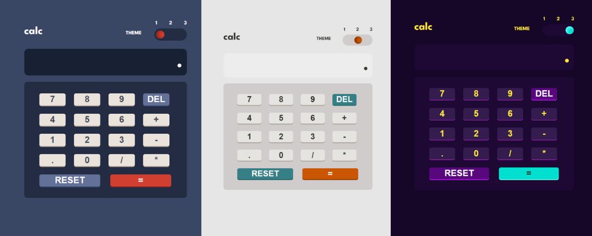

# Calculator app

## Table of contents

- [Overview](#overview)
  - [Screenshot](#screenshot)
  - [Links](#links)
- [My process](#my-process)
  - [Built with](#built-with)
  - [What I learned](#what-i-learned)
  

## Overview

### Screenshot

### Links

- See what the calculator looks like and use it [here](https://onanuviie.github.io/Js-calculator-with-color-theme/)

## My process

### Built with

- Semantic HTML5 markup
- CSS custom properties
- Flexbox
- Mobile-first workflow
- setInterval()
- Array Methods

### What I learned

This was my first time creating a toggle/ switch button that gives a website/ app diffent themes. I learnt that it can be easily implemented by adding and removing certain classes

